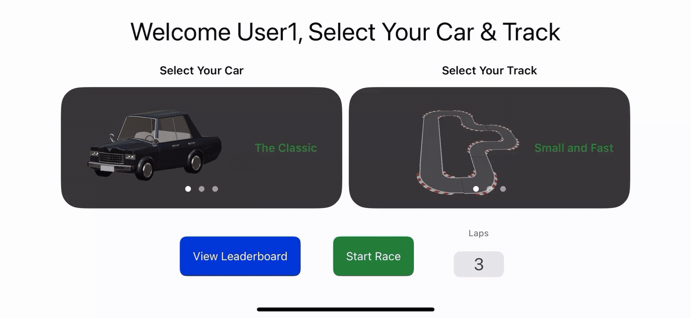
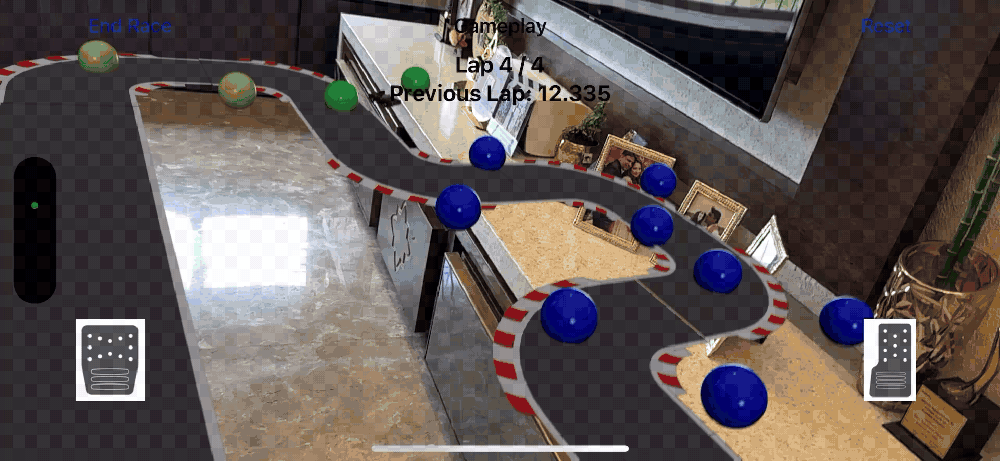

# 🏁 RaceARound

**RaceARound** is an augmented reality (AR) racing game for iOS that brings tabletop racing into the real world. Built entirely from scratch as my final project, this app showcases interactive AR gameplay, physics-based driving, track placement, lap validation, and leaderboard tracking — all running locally on-device with Swift, ARKit, RealityKit, CoreMotion, and SwiftUI.

> ✨ This was my own idea and independent final project — no templates, no teams — just design, code, iteration, and fun.

---

## 🚗 Gameplay Overview

-   **Choose Your Car & Track**: Select from 3 custom-modeled cars and 3 handcrafted AR tracks.
-   **Place in Real World**: Drop the track and car onto any flat surface using your iPhone/iPad camera.
-   **Race with Motion Controls**: Tilt to steer, use two-finger gestures to accelerate and brake.
-   **Checkpoint Logic**: Laps count only if all checkpoints are crossed in the right sequence.
-   **Leaderboard System**: Saves best lap times locally with username, car, track, and timestamp.

---

## 📸 Demo

### 🏠 Home Interface & Leaderboard Setup

Swiping between car and track options, customizing username, and seeing it reflected in the welcome message.

    

### 🕹️ AR Racing in Action

Placing car and track in real-world view, using motion controls to drive, and observing validation when checkpoints are missed or followed.

    

### 🏁 Lap Time + Leaderboard Integration

Post-race summary with individual lap breakdown, and leaderboard auto-updates with fastest lap from the session.

    

---

## 🛠 Tech Stack

-   **Language**: Swift 5
-   **Frameworks**:
    -   `RealityKit` – 3D models, physics, scene handling
    -   `ARKit` – plane detection, anchoring
    -   `CoreMotion` – tilt-based steering
    -   `SwiftUI` – user interface and navigation
    -   `Codable` + `JSONEncoder` – local data storage (leaderboards, cars/tracks)

---

## 🎮 Features

### 🚙 Cars

-   Unique 3D AR model + thumbnail image
-   Acceleration, coasting, and brake physics
-   Speed caps vary per car

### 🛣️ Tracks

-   3 different track types (short, long, maze)
-   AR-anchored, with checkpoint logic for lap validation

### 🧠 Driving Physics

-   Smooth motion-based steering
-   Throttle, coast, brake control logic
-   Realistic deceleration behavior

### 🏆 Leaderboard

-   Stores and displays top 10 lap times
-   Tracks username, car, track, lap time, and date

---

## 📦 Assets

-   Cars: BlenderKit & other public 3D model sources
-   Tracks: Modified Blender circuits
-   Models exported as `.usdz` for ARKit compatibility

---

## 💡 Inspiration

As a lifelong racing enthusiast, I wanted to merge my passion for cars, gaming, and immersive tech. **RaceARound** was my canvas to explore gameplay mechanics and player feedback in AR.

---

## 🔚 Final Thoughts

**RaceARound** isn't just a class project — it's proof of how far you can go when you mix passion with technology.

---

## 🧠 Let’s Connect!

**Tej Jaideep Patel**  
B.S. Computer Engineering  
📍 Penn State University  
✉️ tejpatelce@gmail.com  
📞 814-826-5544

---
